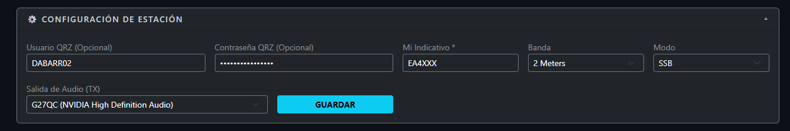
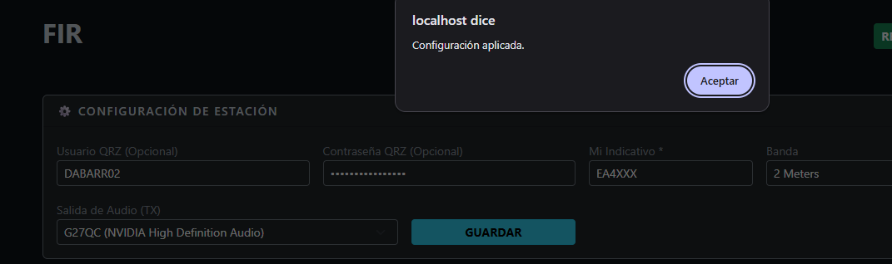
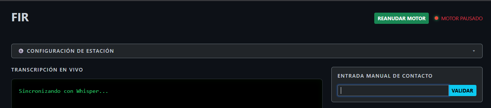
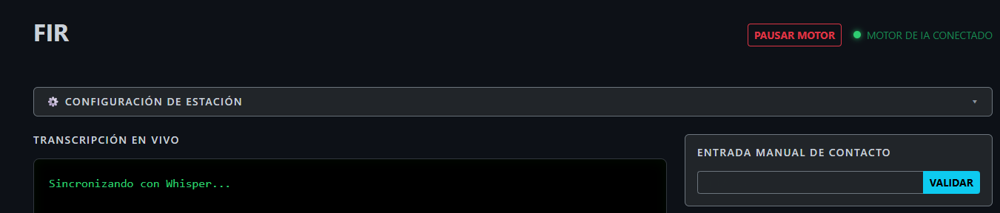
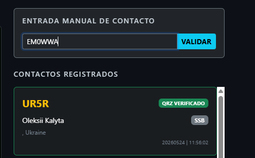
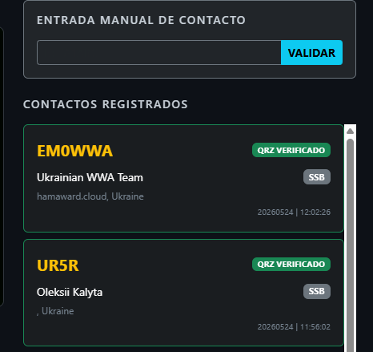
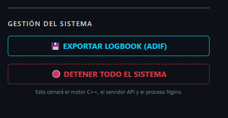
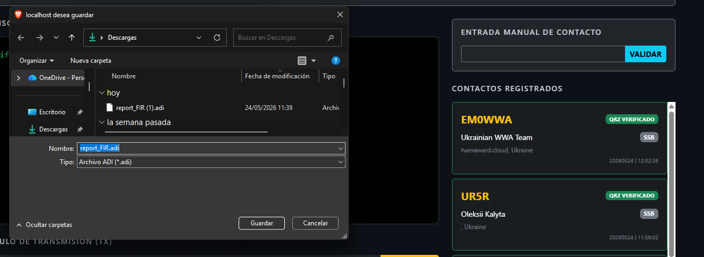
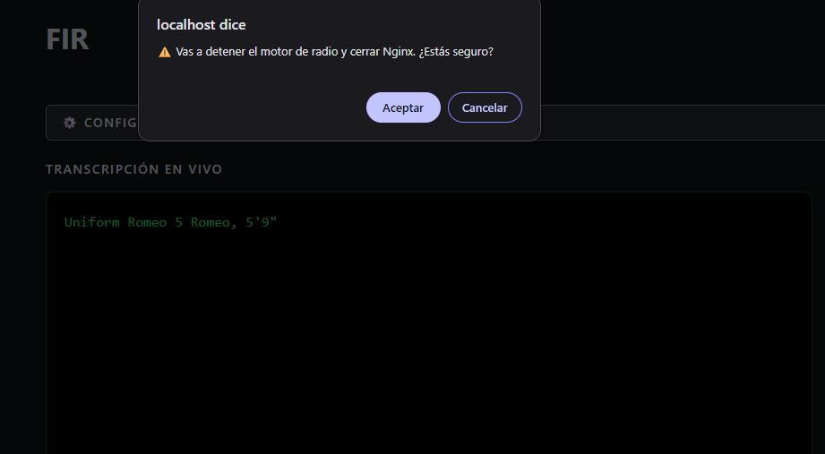
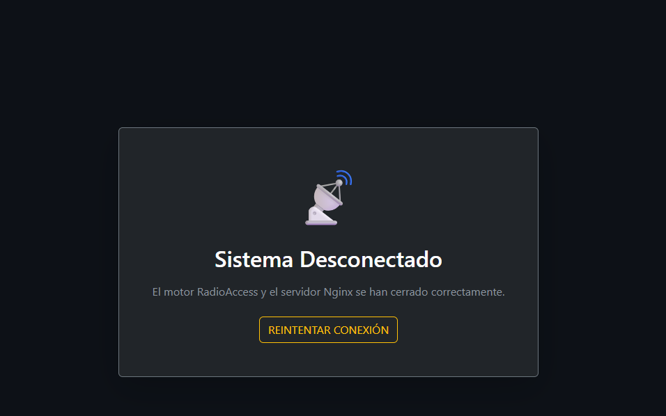

# Manual de usuario

Esta guía describe cómo iniciar FIR, configurar la estación, utilizar las principales opciones de la interfaz y apagar el sistema correctamente.

## Puesta en marcha y configuración inicial

Descarga y extrae el paquete correspondiente a tu equipo. Ejecuta `FIR.exe` con doble clic. La interfaz web se abrirá automáticamente en `http://localhost`.

En el primer arranque, introduce el indicativo del operador en la sección **Configuración de estación** y pulsa **Guardar**. FIR informará si la operación se realizó correctamente.

*Proceso de configuración de la estación. Fuente: elaboración propia.*

FIR comienza en modo de espera. Pulsa el botón verde **Reanudar motor**, situado en la esquina superior derecha, para iniciar la captura y el procesamiento de audio. El sistema transcribirá el audio recibido desde el dispositivo de entrada seleccionado en Windows.

*Estados de inicialización y funcionamiento del motor de audio. Fuente: elaboración propia.*

## Transmisión de audio a partir de texto

Escribe el mensaje en el cuadro de texto del módulo de transmisión y pulsa **Enviar** o la tecla `Enter`. FIR transformará el texto en audio mediante el motor TTS configurado.

## Gestión y validación de contactos

Cuando FIR detecta un texto compatible con un indicativo de radio, consulta QRZ.com si se han configurado las credenciales y recupera los datos asociados.

Si el indicativo no se detecta automáticamente, introdúcelo en **Entrada manual de contacto**. La interfaz mostrará el resultado de la validación.

*Proceso de enriquecimiento de datos del contacto. Fuente: elaboración propia.*

Una vez verificados los datos, pulsa el botón de validación para registrarlos en el `logbook` local. Al hacer clic en una entrada del registro de contactos, se abrirá en el navegador el perfil correspondiente de QRZ.com.

## Exportación ADIF y apagado

FIR puede generar un informe en el estándar internacional ADIF (*Amateur Data Interchange Format*). Pulsa el botón de exportación para generar un archivo descargable compatible con software de terceros.

*Gestión de salida de datos e informes. Fuente: elaboración propia.*

Para cerrar FIR, utiliza el control **Detener todo el sistema** de la sección **Gestión del sistema**. Este control detiene el motor de audio y el servidor web de forma controlada.

*Secuencia de finalización controlada. Fuente: elaboración propia.*
